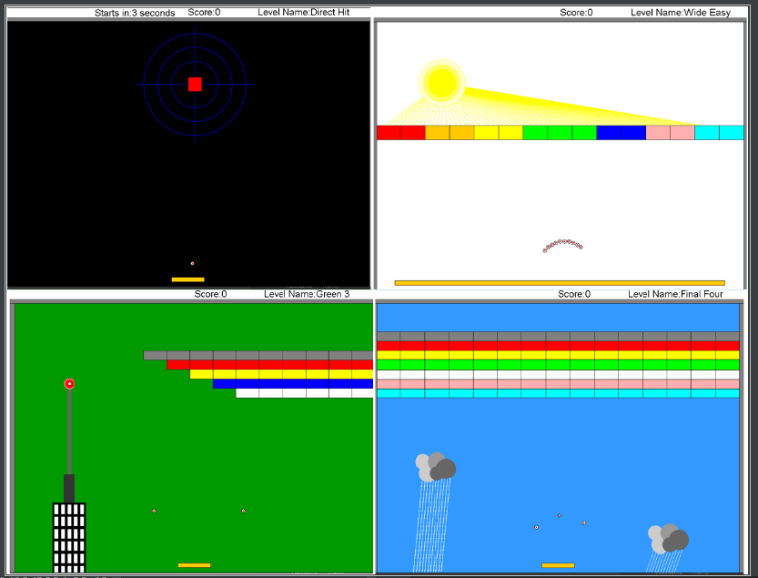

# Java Arkanoid Game

A fun and engaging Arkanoid game developed using Java, OOP principles, design patterns, and a GUI.

## Getting Started
### Prerequisites
To run this game, you need to have the following software installed on your computer:

Java SE Development Kit 8 or later
Ant build tool (optional)
An IDE such as IntelliJ IDEA or Eclipse (optional)
Downloading the Code
You can download the code from this repository by clicking the "Clone or download" button and then "Download ZIP". Once the download is complete, unzip the file to a directory of your choice.

## Running the Game
### Using Ant
If you have Ant installed, you can run the game from the command line by navigating to the project directory and typing the following command:
``` $ant run ```
### Using an IDE
If you prefer to use an IDE, you can open the project in IntelliJ IDEA or Eclipse and run the game from there. To do this, you need to import the project into the IDE and then run the Main class.

## How to Play
Use the left and right arrow keys to move the paddle and space bar to launch the ball. Your goal is to hit all the blocks with the ball and progress to the next level. The game has four levels in total. Good luck!

## What I Learned
Working on this project was a great learning experience for me. I had the opportunity to put into practice what I learned about Java, OOP principles, design patterns, and GUI development. Some of the key things I learned include:

- Java programming concepts such as classes, objects, inheritance, and polymorphism.
- OOP principles such as encapsulation, abstraction, and inheritance.
- Design patterns such as the Singleton pattern and the Observer pattern.
- GUI development using JavaFX and the Scene Builder tool.
## Conclusion
I hope you enjoy playing this Arkanoid game as much as I enjoyed developing it. If you have any questions or feedback, please feel free to reach out to me. Thank you for checking out my project!



